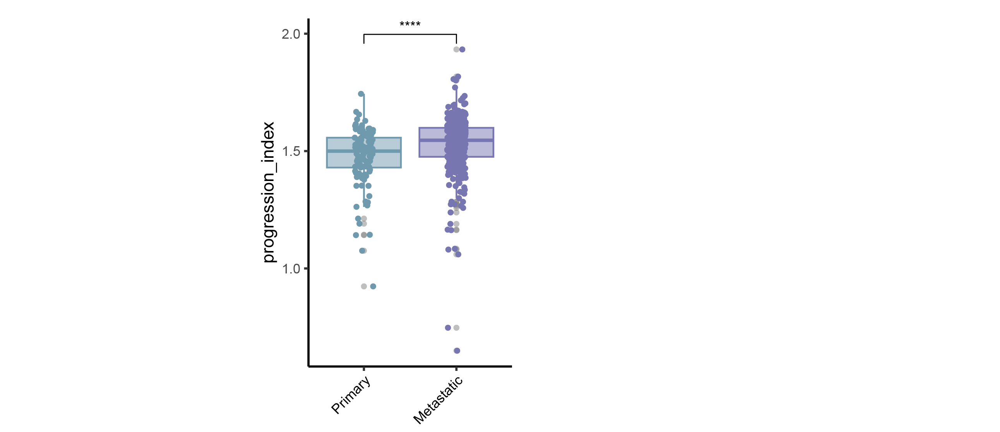
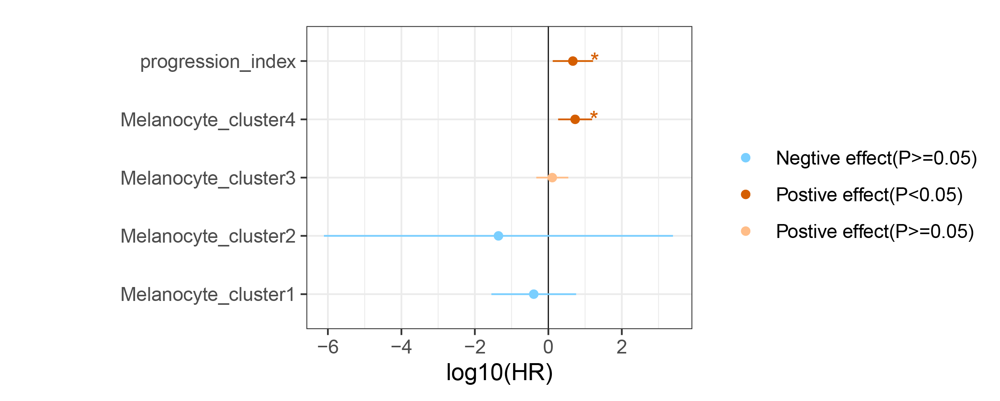
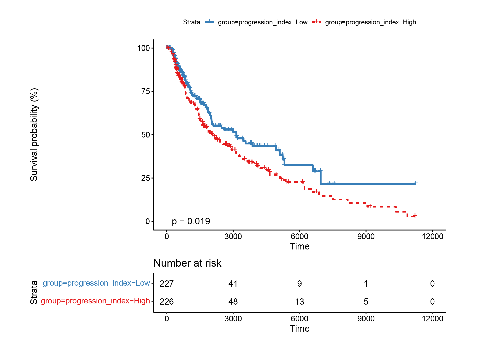

# melscore

Determining the Melanoma Progression Stage from Deconvolution Results

Utilizing the melanoma malignant progression map we've built at single-cell resolution, 'melscore' will deduce the proportions of melanoma cell infiltration linked to various levels of malignancy within bulk samples. Employing a scoring model, 'melscore' could compute the melanoma progression status for each sample, which will serve as a basis for subsequent functional and clinical-related analyses.


1 Installation
---------------

* R packages:
	
	cluster, factoextra, ggplot2, ggpubr, ggthemes, NbClust, RColorBrewer, reshape2, Seurat, survival, survminer

* If all dependent packages and commands have been installed, please use the following codes to install/update the package in R terminal. 

```````
library("devtools");
install_github("ansheng0/melscore")
```````


2 Usage
----------

1) load the melanoma malignant progression map at single-cell resolution, which served as the reference for subsequent inferences within bulk samples.
```````
library(melscore)
load(system.file("extdata/sc.dat.filtered.pc.rda", package = "melscore"))
dim(sc.dat.filtered.pc)
#[1] 29470 16252
```````

2) Load our example bulk RNA sequencing data or load your provided bulk RNA sequencing data, please ensure it includes count values, with rows representing samples and columns representing genes. During this process, we integrated the proportions of melanocytes from different stages of progression, ultimately forming a progression index score to represent the overall progression status of melanoma.
```````
data(bk.dat,package="melscore")
bk.dat[1:4,1:4]
             # TSPAN6  TNMD DPM1 SCYL3
# TCGA-EB-A6QY   3148     1 3466   477
# TCGA-D9-A4Z5   4371     5  882   511
# TCGA-W3-A828   2178 37849 1240   552
# TCGA-LH-A9QB    803     7 2028   841

sc.dat.filtered.pc[1:4,1:4]
                           # A1BG A1CF A2M A2ML1
# D1_140460_SampleTag12_hs_1    0    0   0     0
# D1_789896_SampleTag12_hs_1    0    0   0     0
# D1_747152_SampleTag12_hs_1    0    0   0     0
# D1_13402_SampleTag12_hs_1     0    0   0     0

res0 <- Melanocyte_proportion(bk.dat=bk.dat, out_dir='./', key="Melanocyte_cluster4")
```````

3) Please provide sample phenotype data. In this section, it can include clinical survival data as well as patient classification data. For example, you can refer to the sample data we provided to analyze the associations between different cell types and patient prognosis, as well as other phenotypes.
```````
data(TCGA_SKCM_surv,package="melscore")
head(TCGA_SKCM_surv)
             # OS.time OS SampleType
# TCGA-EB-A6QY     382  0    Primary
# TCGA-D9-A4Z5     218  0    Primary
# TCGA-W3-A828    3683  1 Metastatic
# TCGA-LH-A9QB   11217  0 Metastatic
# TCGA-EB-A5VU     321  1    Primary
# TCGA-GN-A268    1910  1 Metastatic

Clinical<-TCGA_SKCM_surv[,'SampleType',drop=FALSE]
theta<-read.csv("./theta.csv", row.names=1)
res1 <- Melanocyte_proportion_clinical(out_dir='./', theta=theta, Clinical=Clinical, plot_var=c("progression_index"), tag=list(c("Primary","Metastatic")), cols=c("Metastatic"="#7876b1", "Primary"="#6f99ad"))  
```````



4) Please supply survival data for investigating the correlation between various cell clusters / progression index and patient prognosis.
```````
theta<-read.csv("./theta.csv", row.names=1)
res2 <- Melanocyte_proportion_survival(out_dir='./', theta=theta, Survival=TCGA_SKCM_surv[,c('OS.time','OS')])
```````






3 Cite BayesPrism:
-----------

Cell type and gene expression deconvolution with BayesPrism enables Bayesian integrative analysis across bulk and single-cell RNA sequencing in oncology

Tinyi Chu, Zhong Wang, Dana Pe’er & Charles G. Danko 

https://www.nature.com/articles/s43018-022-00356-3

